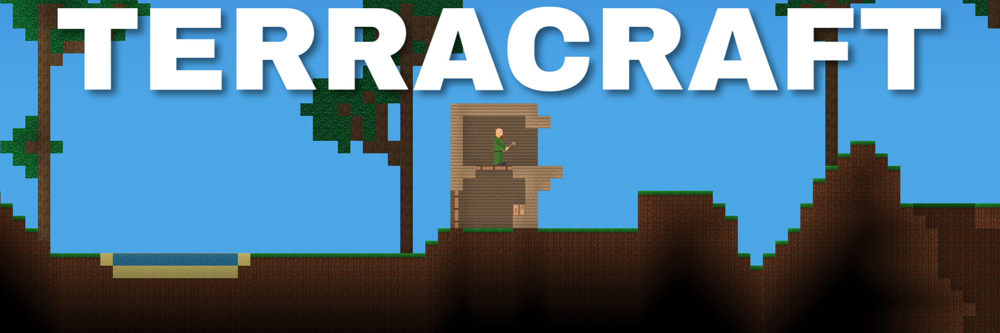

# TerraCraft

2D-игра, упрощённый вариант Terraria, команда Алексея Костюченко

### Участники:
* [Алексей Костюченко @Shaniser](https://github.com/Shaniser)
* [Илья Каркин @Mitbus](https://github.com/Mitbus)
* [Илья Щербаков @ylyxa](https://github.com/ylyxa)
* [Искандер Омуров @IskanderO](https://github.com/IskanderO)
* [Никита Волков @VolkovNik](https://github.com/VolkovNik)
* [Светлана Пирожкова @pirosveta](https://github.com/pirosveta)
* [Надим Абдул Гани @whitequartz](https://github.com/whitequartz)
* [Владислав Ломтев @Irautak](https://github.com/Irautak)

### Управление:
* a, d -движение влево и вправо
* w - прыжок
* s - переход между слоями
* 1, 2, ... , 8 - переключение блоков в инвентаре
* ПКМ - поставить блок/взаимодействие
* ЛКМ - сломать блок
