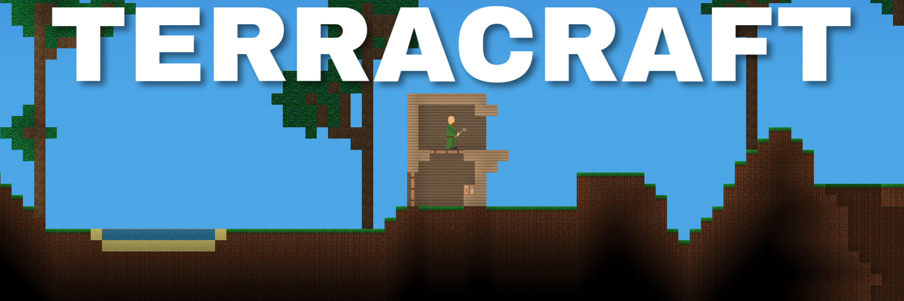

# TerraCraft

2D-игра, «TerraCraft», команда Алексея Костюченко

----
### Описание:
Игра позволяет игрокам ломать и устанавливать различные блоки, взаимодействовать с предметами, путешествовать по миру и исследовать подземелья.

----
### Участники:
* [Алексей Костюченко @Shaniser](https://github.com/Shaniser)
* [Илья Каркин @Mitbus](https://github.com/Mitbus)
* [Илья Щербаков @ylyxa](https://github.com/ylyxa)
* [Искандер Омуров @IskanderO](https://github.com/IskanderO)
* [Никита Волков @VolkovNik](https://github.com/VolkovNik)
* [Светлана Пирожкова @pirosveta](https://github.com/pirosveta)
* [Надим Абдул Гани @whitequartz](https://github.com/whitequartz)
* [Владислав Ломтев @Irautak](https://github.com/Irautak)

----
### Управление:
| Кнопка        | Описание                        |
| ------------- | ------------------------------- |
| a, d          | движение влево и вправо         |
| w             | прыжок                          |
| s             | переход между слоями            |
| i             | открыть / закрыть инвентарь     |
| o             | открыть / закрыть окно крафта   |
| 1, 2, ... , 8 | переключение блоков в инвентаре |
| ПКМ           | поставить блок / взаимодействие |
| ЛКМ           | сломать блок                    |
| f             | сохранить игру                  |
| g             | удалить сохранение игры         |
